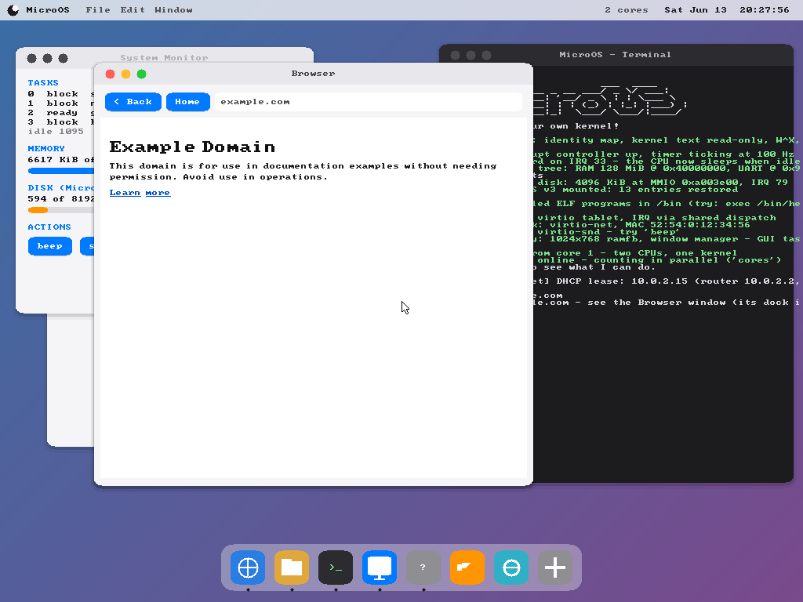

# MicroOS

**Built by Omar Hamama.** Free and open source under the [MIT License](LICENSE) — use it, learn from it, build on it.

A small but complete operating system for ARM64, written from scratch
for education. No Linux, no libraries, no firmware help — every
instruction that runs is in this repository. It boots in QEMU on an
Apple Silicon Mac, opens a desktop with a working mouse, runs user
programs loaded from its own journaled filesystem in private address
spaces, configures its network by DHCP, downloads real web pages over
its own TCP stack — including **HTTPS, with a from-scratch TLS 1.3
client and full certificate validation** — plays sound, and counts on
two CPU cores at once.



## What it does

**Kernel**
- Boots a bare ARM64 CPU (boot.S wears a Linux kernel header so QEMU
  follows the full boot protocol and hands over a Device Tree, which
  [dtb.c](src/dtb.c) parses like a real kernel)
- MMU with identity-mapped kernel, W^X, unmapped null page — `crash
  null|wro|exec` each demonstrate one protection catching one bug class
- Preemptive round-robin scheduler + **wait queues**: tasks BLOCK on
  events and the interrupt that produces the event wakes them
  (converting the net stack from polling cut ping latency 70x)
- **Real processes**: the shell loads ELF programs from `/bin` into
  private address spaces (own page tables, TTBR0 switch per process),
  with `fork`/`exec`/`wait`/`pipe`. Run `rogue` to watch one try to
  read kernel memory — the address simply doesn't exist in its tables
- Syscalls over `svc` with user-pointer validation (EFAULT, like Linux)
- **SMP**: core 1 is woken via PSCI, enables its own MMU, and counts
  in parallel (`cores`) — with a real spinlock guarding the one
  structure both cores share, and an honest essay in
  [smp.c](src/smp.c) about why the rest of the kernel isn't SMP-safe yet

**Storage**
- MicroFS v3 ([mfs.c](src/mfs.c)): superblock, block bitmap, inodes
  with single-indirect blocks (76 KiB files), directories as files
- **Write-ahead journal**: every metadata operation commits atomically;
  run `crashfs` to crash mid-write and watch boot replay heal it
- Write-through LRU block cache ([bcache.c](src/bcache.c)) — `disk`
  shows the hit rate

**Network** ([net.c](src/net.c), [udp.c](src/udp.c), [dns.c](src/dns.c), [tcp.c](src/tcp.c))
- virtio-net driver under a hand-written stack: Ethernet, ARP, IPv4,
  ICMP, UDP, TCP (happy-path: real handshakes and sequence numbers,
  no retransmit — the honest trade is documented)
- **DHCP client** — the OS negotiates its own address at boot
- **DNS resolver** (`nslookup example.com`)
- **`wget example.com`** — fetches a real page from the actual
  internet through QEMU's NAT and saves it to /download.html

**Cryptography & TLS** — a from-scratch **TLS 1.3 client** ([tls.c](src/tls.c))
- Every primitive hand-written and checked against RFC/NIST vectors and
  openssl: **SHA-256/384/512** + HMAC + HKDF ([sha256.c](src/sha256.c), [sha512.c](src/sha512.c)),
  **ChaCha20-Poly1305** AEAD ([chacha20.c](src/chacha20.c)), **X25519** ECDH
  ([x25519.c](src/x25519.c)), **RSA** PKCS#1 v1.5 + PSS ([rsa.c](src/rsa.c) on a
  [bignum.c](src/bignum.c) modexp), **ECDSA P-256** ([p256.c](src/p256.c))
- A real **TLS 1.3 handshake**: ClientHello/ServerHello, the HKDF key
  schedule, AEAD-protected records with sequence-number nonces, and a
  transcript hash — proven both against a controlled server and against
  the live internet
- **Full certificate validation**: an X.509/DER parser ([x509.c](src/x509.c)),
  chain building to a built-in **root CA store** ([cacerts.c](src/cacerts.c):
  ISRG Root X1, two DigiCert roots, GTS Root R1, Amazon Root CA 1),
  per-link RSA/ECDSA signature
  checks, SAN hostname matching, and expiry against the RTC. The server
  also signs the handshake (CertificateVerify) with its cert key — both
  must pass or the connection aborts
- **`https community.letsencrypt.org`** — handshake, validate, decrypt a
  real page; the terminal prints the verified root (e.g. *ISRG Root X1*).
  The honest limit (in the spirit of the rest of the project): **P-384
  curve keys aren't implemented**, so chains using them are refused with
  a clear message rather than a false "secure". Entropy for keys comes
  from the cycle counter — fine to demonstrate TLS, not to guard real
  secrets ([rng.c](src/rng.c) says so plainly)

**Devices & UI**
- 1024x768 double-buffered desktop painted by a kernel task, with a
  real **window manager**: a window table with z-order, click-to-focus
  / raise, drag, and working traffic lights — **red closes, yellow
  minimizes to the dock, green zooms**; the dock restores a window.
  The desktop boots **clean** — apps open from the dock on click. The
  **menu bar works like macOS**: it shows the **focused app's name in
  bold** (right of the ), and that name changes as you switch apps. The
  dropdowns: the ** menu** has **About MicroOS** (a live-vitals About
  box), **Restart**, **Shut Down** (the last two via PSCI,
  [power.c](src/power.c) — same as the `reboot`/`shutdown` shell
  commands); the **App menu** (the app's name) has **About *App***,
  **Settings…**, **Hide**, **Quit *App***; **File** is app-aware (Save in
  TextEdit, Home in the Browser, Close Window); **Edit** is a working
  Copy / Paste with a small system clipboard; and **Window** lists the
  open windows and switches between them.
  Clicks respect occlusion (a button behind another window can't be
  pressed through it). An **interactive terminal you type into**, a
  live system monitor, and **clickable buttons** (immediate-mode
  widgets — a button is a function, not an object)
- **virtio-keyboard**: keystrokes in the QEMU window decode to ASCII
  and feed the very same input queue as the serial port, so the
  on-screen terminal drives the shell — type `ls`, `lisp`, anything
- virtio-tablet mouse, virtio-snd sound (`beep 440 500` — a square
  wave generated in-kernel), interrupt-driven UART serial console
- a **music player** (the Music window): a Winamp-style player with a
  green LCD time display, scrolling track title, transport controls,
  seek + volume sliders, a playlist, and a **spectrum analyzer** that
  dances to the beat (a real integer filterbank — no FFT, no FPU). It
  streams PCM to the sound card buffer-by-buffer, the card's playback
  completion pacing the whole thing. It plays a **built-in chiptune**
  synthesized from scratch ([synth.c](src/synth.c) — square/triangle/
  noise voices over an Am–F–C–G arpeggio), any **.wav** files on disk
  ([wav.c](src/wav.c), resampled to 44.1 kHz on the fly), and real
  **.mp3 files** — a full **MPEG-1 Layer III decoder** ([mp3.c](src/mp3.c):
  bit reservoir, Huffman tables, requantization, the 12/36-point IMDCT,
  and the polyphase synthesis filterbank), verified bit-faithful against
  ffmpeg. The decode core is adapted from the public-domain **PDMP3**
  (the ISO tables are its data; the algorithm is its proven pipeline);
  MicroOS makes it run with **no libc and no libm** (all sin/cos/pow are
  precomputed tables) and turns on the **FPU** for just this one file —
  the player task is the sole floating-point user, so no context-switch
  FP save/restore is needed. A sample riff ships at `/music/sample.mp3`
- an **image viewer** (the Preview window, [imgview.c](src/imgview.c)):
  double-click a `.png` or `.jpg` in Files to open it scaled-to-fit;
  the Files preview pane shows a **thumbnail**. It reuses the browser's
  from-scratch [png.c](src/png.c) and [jpeg.c](src/jpeg.c) decoders.
  Samples ship in `/pictures`
- a **text editor** (the TextEdit window, [editor.c](src/editor.c)):
  open any file (double-click it in Files, or it starts on
  `/notes.txt`), type to insert, Backspace/Enter, move the caret with the
  arrow keys or a click, and **Save** writes the buffer straight back to
  the MicroFS disk so edits survive a reboot
- a **PL031 real-time clock**: a live date/time in the menu bar and a
  `date` command, decoding the RTC's epoch seconds into a calendar
  date with the classic civil-calendar algorithm
- a **web browser** (the Browser window): fetches **HTTP and HTTPS**
  pages over the kernel's own TCP/TLS stack ([http.c](src/http.c)), parses
  a subset of HTML ([browser.c](src/browser.c)), renders it in a real
  **proportional font** ([propfont.c](src/propfont.c), Noto Sans rasterised
  to bitmaps — not the 8x8 blocks) with word-wrap and headings, makes
  **links clickable**, **scrolls**
  (mouse wheel or arrow / Page keys, with a scrollbar), and has an
  **editable address bar** — click it, type a URL, press Enter. It has a
  **movable caret**: arrow keys (and Home/End), or a click, place the
  cursor anywhere in the URL so you can edit mid-string, not just at the
  end (the keyboard driver routes keystrokes to the focused field instead
  of the shell).
  A **padlock** by the address bar turns **green** with the verified
  root CA when a certificate chain checks out, and **red** with the
  reason when it doesn't (e.g. an unsupported P-384 chain) — refusing to
  render rather than lie. (`browse https://community.letsencrypt.org`,
  or click the globe in the dock.) It also has the plumbing real pages
  need: **follows 3xx redirects**, decodes **gzip** (a from-scratch
  DEFLATE inflater, [inflate.c](src/inflate.c)) and **chunked** transfer
  encoding, and understands `host:port`. It applies a **CSS** subset
  ([css.c](src/css.c): the cascade — tag/class/id selectors + inline
  `style`, color/size/weight/align/`display:none`), runs a from-scratch
  **JavaScript** interpreter ([js.c](src/js.c): variables, functions,
  closures, loops) against a tiny **DOM** (`document.write`,
  `getElementById().textContent`, `console.log`), decodes **PNG**
  ([png.c](src/png.c)) and **baseline JPEG** ([jpeg.c](src/jpeg.c): DCT +
  Huffman + an integer IDCT) images to draw them inline, decodes
  **UTF-8**, and even **renders real Arabic** ([arabicfont.c](src/arabicfont.c)):
  a rasterised 16×16 glyph font plus the joining/**shaping** algorithm
  (isolated/initial/medial/final forms) and **right-to-left** layout, so
  مرحبا shows as connected Arabic letters, not placeholders. Accented
  Latin folds to ASCII (café → cafe). The honest ceiling (same spirit as
  the rest): this is the web of the mid-90s, not today's — no CSS layout
  engine; no real-site JS frameworks; JS numbers are integers (no FPU);
  WebP/SVG aren't decoded; CJK and other scripts still fall back to "?"
- a graphical **file manager** (the Files window), Finder-style:
  single-click to select, double-click a folder to open, `..` to go up,
  a file to preview its bytes — with a toolbar to **New folder, Copy,
  Cut, Paste, and Delete** (move = copy + delete; delete is recursive;
  every change writes through to the journaled disk). It navigates and
  edits the same tree the shell's `ls`/`cp`/`rm` would
- a **font manager** (the Fonts window): the system typeface is a single
  swappable pointer ([fonts.c](src/fonts.c)), so picking a face re-skins
  the *whole* desktop — menu bar, windows, terminal — on the next
  repaint. Ships Classic plus Bold and Italic *generated from it* (Bold
  = OR each glyph with itself shifted a column; Italic = shear the rows),
  a tidy lesson in what a typeface is at the pixel level. New faces load
  from `.mf8` bitmap files over plain HTTP (`fontget`) or off the disk
  (`fontload`). Real Google Fonts can't be used — they're HTTPS-only and
  ship vector TTF outlines that need TLS plus a TrueType rasterizer — so
  MicroOS keeps to honest little 8x8 bitmaps in the same format as its
  built-in font
- 41 shell commands tying it all together (`help`)

## Running it

```sh
brew install qemu aarch64-elf-gcc   # one-time setup
make run                            # desktop window + shell in this terminal
make run-term                       # terminal only, no window
```

Quit QEMU: `Ctrl-A` then `X`. `disk.img` holds your files (`make
clean` spares it; `make wipedisk` starts your world over).

### Running it natively on a Raspberry Pi 4

MicroOS isn't QEMU-only — it builds for a second board and boots **bare
metal on a Raspberry Pi 4** (no Linux, no QEMU). A `board.h` abstraction
swaps the addresses; the boot code drops EL2→EL1, the MMU builds the Pi's
memory map, the console is the **PL011 UART**, and the framebuffer comes
from the **VideoCore mailbox** ([mailbox.c](src/mailbox.c)).

```sh
make run-raspi          # build + boot the Pi image in QEMU's raspi4b
make dist-raspi         # kernel8.img + config.txt for a real SD card
```

For real hardware: put `kernel8.img` + `config.txt` (from `make
dist-raspi`) and the Pi's `start4.elf` + `fixup4.dat` firmware on a FAT32
SD card. **HDMI shows the desktop; the console is the PL011 UART** on GPIO
14/15. What works natively today: boot, MMU/W^X, the GIC-400, the timer,
the serial **shell** (interactive), and the **graphical desktop**. Not yet
ported: **USB input** (so the GUI is look-only on the Pi — drive it from
the serial console), the SD card (RAM-only filesystem), networking, and
sound. Verified in QEMU `raspi4b`; real-silicon testing is on you.

### A third target: the R36S handheld (Rockchip RK3326) — UNVERIFIED

There's also a **speculative** build for the R36S retro handheld
(`make BOARD=rk3326` / `make dist-rk3326`). The RK3326 has a GIC-400 and
the standard ARM timer like the Pi, plus a **DesignWare-8250 UART** and a
**simple-framebuffer** path (reuse the framebuffer the device's U-Boot
already lit on the 640×480 panel, read from the DTB). **It is unverified
— there's no emulator for the RK3326, so only the *compile* is checked;
on real hardware it may need address fixups (UART IRQ, GIC bases, FB
format) and would be debugged over the device's serial pads.** It's a
documented starting point, not a finished port.

The grand tour:

```
about                        what this OS is
exec /bin/hello              run a process from disk (then: ps)
exec /bin/rogue              watch process isolation kill a bad actor
wget example.com             DNS + TCP + HTTP, saved to your own disk
https community.letsencrypt.org   TLS 1.3 + verify the cert chain to a root CA
cat download.html            ...see?
crashfs                      crash mid-write; the journal heals on boot
bigtest                      a 76 KiB-capable file via indirect blocks
cores                        what's CPU core 1 doing right now?
ping                         microsecond ICMP round trips
fonts 1                      re-skin the whole desktop in Bold (then: fonts 0)
beep 440 400                 concert A through your speakers
sleep 3                      type during it — nothing is lost
crash null                   a caught null dereference, explained
```

In the window: drag the title bars, click the buttons.

## Source tour (suggested reading order)

| File | What it teaches |
|---|---|
| [linker.ld](linker.ld) / [boot.S](src/boot.S) | kernel memory layout; what a CPU needs before C |
| [src/uart.c](src/uart.c) | MMIO, IRQ-driven input, ring buffers, a 3-generation idle loop |
| [src/vectors.S](src/vectors.S) / [exceptions.c](src/exceptions.c) | trap frames; crashes into readable reports |
| [src/gic.c](src/gic.c) / [timer.c](src/timer.c) | interrupt routing; the preemption heartbeat |
| [src/mmu.c](src/mmu.c) | page tables, W^X, per-process address spaces |
| [src/mem.c](src/mem.c) | a coalescing allocator + a page-frame allocator |
| [src/task.c](src/task.c) / [switch.S](src/switch.S) | context switch, scheduler, wait channels |
| [src/syscall.c](src/syscall.c) / [proc.c](src/proc.c) | the svc door; files becoming processes |
| [user/](user/) | a real user program: crt0, syscall stubs, its own linker script |
| [src/fs.c](src/fs.c) / [mfs.c](src/mfs.c) / [bcache.c](src/bcache.c) | VFS cache, inodes, journaling, LRU |
| [src/virtio.c](src/virtio.c) + blk/input/net/snd | one driver core, four personalities |
| [src/net.c](src/net.c) → [udp.c](src/udp.c) → [dns.c](src/dns.c) → [tcp.c](src/tcp.c) | the protocol tower, bottom to top |
| [src/fb.c](src/fb.c) / [gui.c](src/gui.c) | double buffering; windows, cursors, immediate-mode widgets |
| [src/fonts.c](src/fonts.c) | what a typeface is at the pixel level; bold/italic from one face |
| [src/http.c](src/http.c) / [browser.c](src/browser.c) | HTTP(S) GET, redirects; HTML parse + flow layout |
| [src/inflate.c](src/inflate.c) / [png.c](src/png.c) / [jpeg.c](src/jpeg.c) | DEFLATE/gzip; PNG + baseline-JPEG image decoders |
| [src/css.c](src/css.c) / [js.c](src/js.c) | a CSS-cascade subset; a tiny JS interpreter + DOM |
| [src/sha256.c](src/sha256.c) / [chacha20.c](src/chacha20.c) / [x25519.c](src/x25519.c) | the crypto primitives, each ~one idea |
| [src/bignum.c](src/bignum.c) / [rsa.c](src/rsa.c) / [p256.c](src/p256.c) | big-integer modexp; RSA & ECDSA signature checks |
| [src/asn1.c](src/asn1.c) / [x509.c](src/x509.c) / [cacerts.c](src/cacerts.c) | DER parsing, certificate chains, the trust store |
| [src/tls.c](src/tls.c) | the TLS 1.3 handshake, key schedule, and record layer |
| [src/spinlock.h](src/spinlock.h) / [smp.c](src/smp.c) | atomics, the second core, why locks exist |

## The bug museum

Real bugs met while building this, each now a documented lesson at the
spot it bit: the UART ack-before-service race ([uart.c](src/uart.c)),
the saved-ELR/SPSR trap-frame gotcha ([vectors.S](src/vectors.S)), the
idle-loop stack-overflow recursion ([task.c](src/task.c)), the GICv2
"SPIs target nobody on SMP" reset value ([gic.c](src/gic.c)), and a
stale-object build bug that became header-dependency tracking
([Makefile](Makefile)).

## Userland (the latest milestone)

MicroOS now has a real user space. Programs in [user/](user/) compile
to **ELF executables** (their own [tiny libc](user/ulib.c)), are
installed into `/bin`, and the shell launches them as isolated EL0
processes:

```
microos:/> ls /bin
  hello  rogue  echo  cat  ls  forkdemo  wc  pipedemo
microos:/> echo hello from a real program
hello from a real program
microos:/> cat /welcome.txt | wc -l
4
```

And it runs a **real language** — a tiny Lisp ([user/lisp.c](user/lisp.c)),
written from scratch, that computes with recursion and closures:

```
microos:/> lisp
lisp> (define (fact n) (if (< n 2) 1 (* n (fact (- n 1)))))
lisp> (fact 10)
=> 3628800
lisp> (define (adder n) (lambda (x) (+ x n)))
lisp> (define add5 (adder 5))
lisp> (add5 100)
=> 105
```

Under the hood: an [ELF64 loader](src/proc.c) with per-segment W^X;
[file descriptors](src/file.c) over console/file/pipe behind one
`read`/`write`; `fork`/`exec`/`wait`/`getpid`/`dup2`/`pipe`
[syscalls](src/syscall.c); [pipes](src/pipe.c) with blocking + EOF; and
a shell that runs `/bin` programs and joins them with `|`.

## Where to take it next

1. **copy-on-write fork** — today fork eagerly copies every page; share
   them read-only and copy on first write (the classic optimization, so
   fork+exec costs nothing).
2. **A userland shell** — move the shell itself into `/bin/sh` as a
   process, with line editing and scripting, instead of living in the
   kernel.
3. **TCP retransmission + congestion control** — the other half of
   TCP's soul; what happens on networks where packets actually vanish.
4. **A real SMP scheduler** — per-structure locks (start with the run
   queue), then let core 1 run tasks. [smp.c](src/smp.c) explains the
   size of that dragon.
5. **ASIDs** — tag TLB entries per-process so context switches stop
   flushing everything.
6. **GUI damage tracking & a keyboard window** — repaint only changed
   rectangles; route a virtio-keyboard to a focused window.
7. **A bigger language** — `/bin/lisp` proves a real interpreter runs
   here; next would be a garbage collector for it (the arena is fixed
   today), or porting an external engine like QuickJS once user `malloc`
   and more libc exist.

## References

- [OSDev wiki](https://wiki.osdev.org/) · ARM ARM (ARMv8-A) ·
  [virtio spec](https://docs.oasis-open.org/virtio/virtio/v1.2/virtio-v1.2.html)
- [Linux ARM64 boot protocol](https://www.kernel.org/doc/html/latest/arch/arm64/booting.html)
  · [QEMU virt board](https://www.qemu.org/docs/master/system/arm/virt.html)
- MIT's [xv6 book](https://pdos.csail.mit.edu/6.828/2023/xv6/book-riscv-rev3.pdf)
  — the best short textbook on everything here
- RFCs worth reading with this code open: 826 (ARP), 791 (IP), 792
  (ICMP), 768 (UDP), 2131 (DHCP), 1035 (DNS), 793 (TCP)

## Author & license

MicroOS was **built by Omar Hamama** as a from-scratch learning project
(with the help of Claude). It is **free and open source** under the
[MIT License](LICENSE) — you're welcome to use it, study it, fork it, and
build on it.

A handful of pieces include third-party material (the MP3 decoder adapts
the public-domain PDMP3; the trust store ships real public root certs; the
bitmap fonts are rasterized from system fonts). See [NOTICE.md](NOTICE.md)
for the full, honest breakdown.
